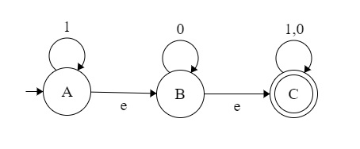
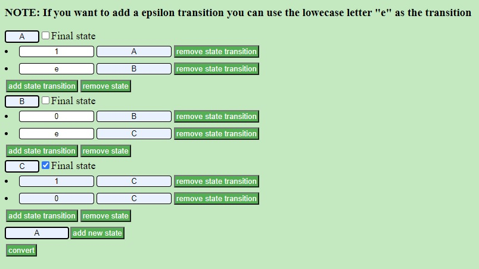
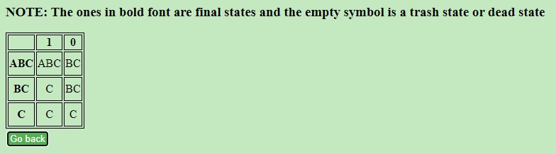
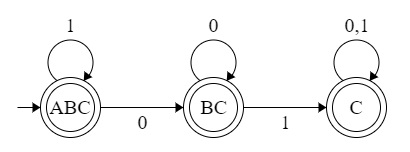

# NFA to DFA automata conversion with epsilon closure
 
This proyect was made in react js with the knowlegde acquired in the course of compilers and interpreters in the university

### Instalation

If you want to use it right away, this project is deployed in github pages at https://vicjosue.github.io/nfatodfa/

To run this app locally you will need to install React, clone this repository and run "npm start"

### Example

To convert this NFA:

You need to complete the form also don't forget to complete the start state and select your final state:

Once completed, check on "convert" button and will appear a table, this table is solution table:

Drawn as a DFA will appear something like this one:

For this example a have used a tool maded by Evan Wallace to show you the drawn NFA and DFA, here is the link to his page:
http://madebyevan.com/fsm/
